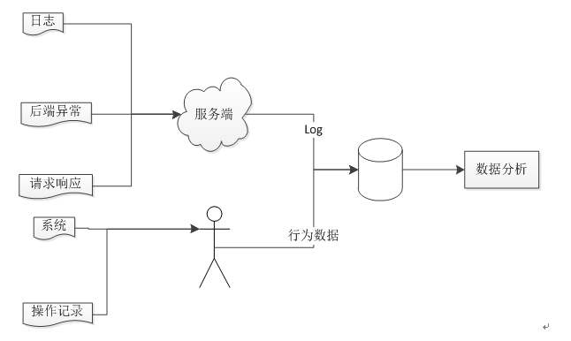

## 为什么要埋点
- 让我们知道什么客户、在什么时间、什么地方发生了什么
- 客户感兴趣的是什么，更好的优化产品
- 分析客户特征，寻找产品对应群体

## 埋点的作用
- pv、uv
- 用户在页面停留时间
- 用户页面行为（比如取消操作）

## 需要埋点的信息
- 当前位置（域名domain + 具体位置 + 标题|自定义name + 具体元素）
- 分辨率（屏幕高度 + 屏幕宽度）
- 使用设备（userAgent）
- 交互行为（查看、点击）
- 角色（客户ID）
- 错误记录（请求异常）

## 实现方案
- 代码埋点（百度统计、数说传播）——埋点不够准确、把数据给第三方
- 可视化埋点（Mixpanel、神策、腾讯MTA）——引进的东西太多，对系统不大友好，需要上报很多东西、交互也多
- 声明式埋点：对某部分进行标识声明，页面扫描并进行监控
- 目前我们做的是声明式埋点：优点是对相应的点进行监控、减少不必要的资源浪费、埋点更精准
- 
## 具体实施方案
- 调研埋点信息
- 对需要监控的点进行声明，看直接声明式埋点能不能满足当前需求，不能的话备选方案是命令埋点，即对需要监控的地方插入相应的监控逻辑
- 写一个全局的埋点函数，封装成一个全局指令，这样全局就可以添加对应的标识即可
- 如果是动态创建的组件，且不可以进行添加指令，调用全局的方法，走的也是跟指令一样的方案
- 发送请求（ajax请求、jsonp、img），因为是内部的埋点监控，目前我们打算采用的是ajax请求，不用考虑跨域的问题
- 将要记录的数据，与公司的日志分析工具一起使用存到相应的数据库|es
- 

## 埋点分析方案
- 由于我们的产品经理都是分析师过来的，所以他们只需要我们把数据库导出到Excel，就可以自己分析
- 分析数据可视化

## 参考链接
- [简书](https://www.jianshu.com/p/a1c7a8c3f07a)
- [手记](https://www.imooc.com/article/27151)
- [CSDN](https://blog.csdn.net/stopllL/article/details/78856214)
- [腾讯](https://mta.qq.com/h5/manage/ctr_app_manage?app_id=500659552)