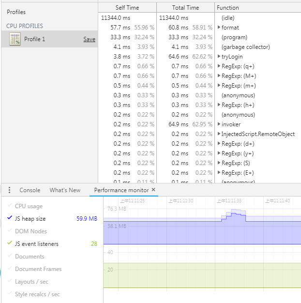

## bug回顾
- 开发的系统有个页面一直很卡，打开chrome开发工具和关闭的时间差别很大，大约是7-8倍左右，这里暂时先不讨论是否打开开发者工具的问题；
- 从标出的两个关键点来看可以明显看出有了时间格式就会指数级的增长倍数
``` js
    /**
    @count = 100
        关闭-开发工具 116ms 
        打开-开发工具 1417ms
        关闭-工具并有时间格式函数 231ms
        打开-开发工具并有时间格式函数 5161ms
        -> 没有log&打开开发工具没有时间格式 0.26ms
        -> 没有log-并打开开发工具&有时间格式 2183ms
    @count = 300
        关闭-开发工具 1007ms 
        打开-开发工具 12415ms
        关闭-工具并有时间格式函数 2055ms
        打开-开发工具并有时间格式函数 47535ms
        -> 没有log&打开开发工具没有时间格式 1.69ms
        -> 没有log&打开开发工具&有时间格式 19501ms
        -> 没有log&打开开发工具&使用moment格式化 991ms
    */
    for (let i = 0; i < count; i++) {
        for (let j = 0; j < count; j++) {
            // 是否有时间格式函数
            format('yyyyMMdd');
        }
    }
```
- 使用时间格式化函数
``` js
    function format(fmt) {
        var o = {
            "M+": this.getMonth() + 1,
            "d+": this.getDate(),
            "h+": this.getHours() % 12 == 0 ? 12 : this.getHours() % 12,
            "H+": this.getHours(),
            "m+": this.getMinutes(),
            "s+": this.getSeconds(),
            "q+": Math.floor((this.getMonth() + 3) / 3),
            "S": this.getMilliseconds()
        },
        week = {
            "0": "\u65e5",
            "1": "\u4e00",
            "2": "\u4e8c",
            "3": "\u4e09",
            "4": "\u56db",
            "5": "\u4e94",
            "6": "\u516d"
        };

        if (/(y+)/.test(fmt)) {
            fmt = fmt.replace(RegExp.$1, (this.getFullYear() + "").substr(4 - RegExp.$1.length));
        }

        if (/(E+)/.test(fmt)) {
            fmt = fmt.replace(RegExp.$1, ((RegExp.$1.length > 1) ? (RegExp.$1.length > 2 ? "\u661f\u671f": "\u5468") : "") + week[this.getDay() + ""]);
        }

        for (var k in o) {
            if (new RegExp("(" + k + ")").test(fmt)) {
                fmt = fmt.replace(RegExp.$1, (RegExp.$1.length == 1) ? (o[k]) : (("00" + o[k]).substr(("" + o[k]).length)));
            }
        }

        return fmt;
    }
```
- 从时间格式化函数来看使用(5 + 8 * 3)个RegExp及两个直接匹配的正则，共31个正则表达式，其他都是常规的运算
- 看到正则语法长这模样，不就是JS中典型的新创建对象的语法么，对了，就是新创建一个正则对象。我们都知道，要尽量避免使用new关键词，使用new无疑就是新创建了一个对象，那么同时就预示着其占据了一定的内存空间，如果处理不当，积累多了会造成内存溢出，这样相当耗费资源，不利于代码优化的实现。
- 每new一次RegExp，新创建一个正则对象，占据了一定的内存空间，这样多次多重循环之后就会创建很多内存
- 通过开性能测试工具性能分析图(总的115ms)，format函数占了55% 
- 

## bug追踪
- 使用的是[知乎专栏.贾磊](https://zhuanlan.zhihu.com/p/36103124)的一份代码(不知道是不是从这拿过去的，查的时候刚好第一个是这篇文章)，


## 解决方案
- 目前还没有时间去修改这个函数，使用moment函数也降了很多时间，但是看源码也是用正则匹配的

## 参考链接
- [脚本之家](https://www.jb51.net/article/75574.htm)